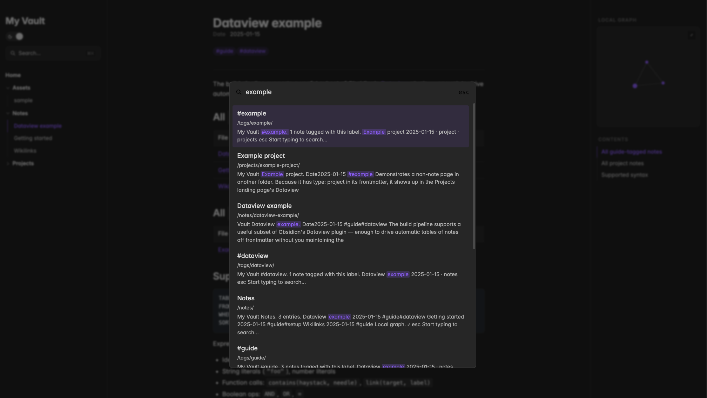
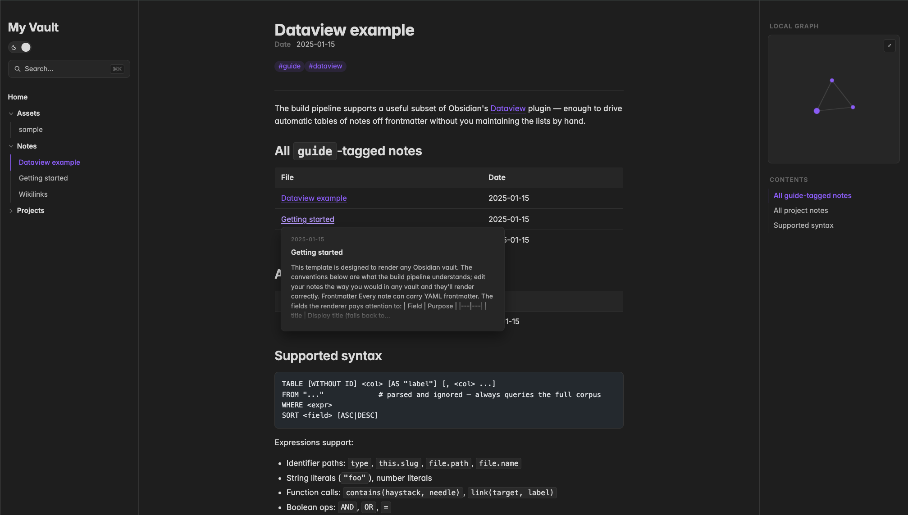
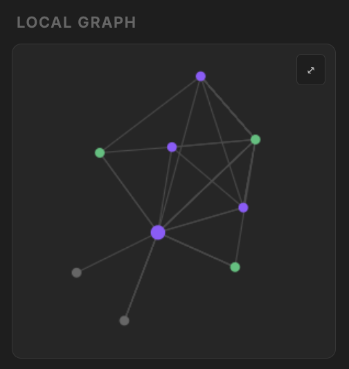
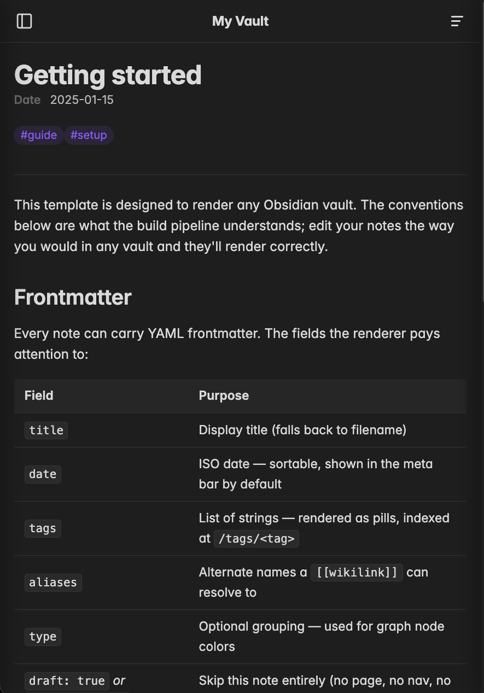
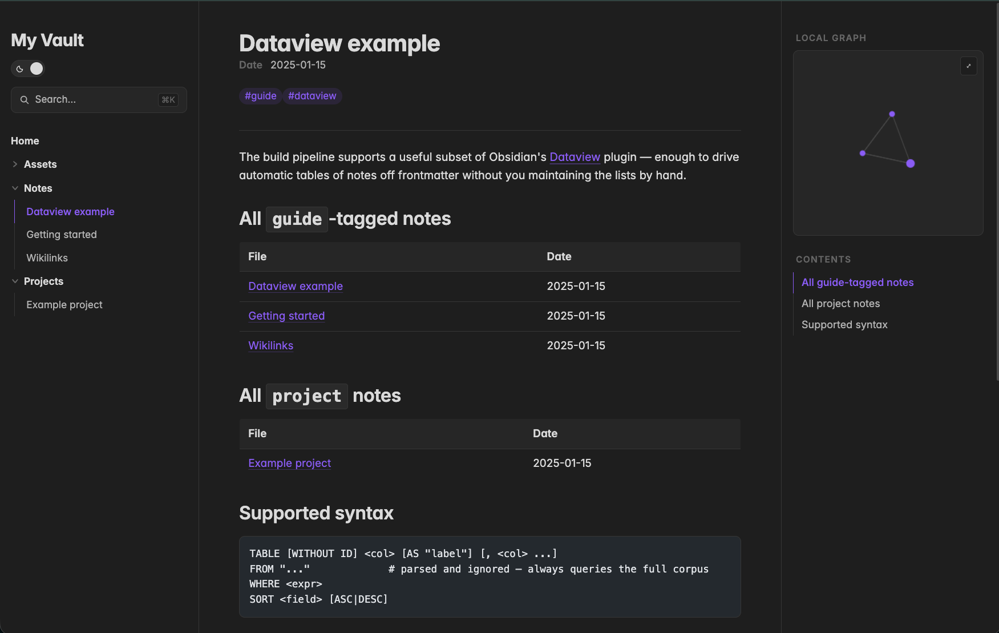

<!--
  Image checklist (docs/images/):
  [✓] local-graph.png            Local force-directed graph
  [✓] full-text-search.png       ⌘K palette with results
  [✓] wikilink-hover-previews.png  Wikilink hover popover
  [✓] mobile-first.png           Phone-width slide-out nav
  [ ] hero-light.png             Desktop note view (light) — uncomment <picture> below when added
  [ ] hero-dark.png              Same in dark mode
  [ ] dataview.png               Rendered TABLE … WHERE … block — uncomment <details> below when added
-->

<h1 align="center">Astro Publish</h1>

<p align="center">
  <strong>A self-hosted, $0 alternative to Obsidian Publish.</strong><br>
  Publish any Obsidian vault as a fast static site that looks and feels like Obsidian Publish — for free.
</p>

<p align="center">
  <a href="#quick-start">Quick start</a> ·
  <a href="docs/deployment.md">Deploy</a> ·
  <a href="docs/authoring.md">Author</a> ·
  <a href="docs/architecture.md">How it works</a>
</p>

<p align="center">
  
  
  
</p>

<!--
  Hero shot — uncomment once docs/images/hero-light.png and hero-dark.png exist.
<p align="center">
  <picture>
    <source media="(prefers-color-scheme: dark)" srcset="docs/images/hero-dark.png">
    
  </picture>
</p>
-->

---

## Why this exists

Obsidian Publish is $10/month per vault, hosted on Obsidian's infrastructure. This template gives you the same UI — collapsible folder tree, wikilinks with hover previews, scroll-spy TOC, force-directed graph, ⌘K full-text search, dark/light theme — as a static site you fully control.

The vault lives as plain markdown in `content/`. A custom Astro publishing layer reads it at build time and emits a static site that runs anywhere — Cloudflare Pages, Netlify, GitHub Pages, S3, your own box. No server, no database, no recurring fees.

Want it private? Optional email-based access control via **Cloudflare Access** gates the whole site (or specific paths) behind one-time-code login — also free for 50 users.

> **Total infrastructure cost on Cloudflare Pages + Cloudflare Access:** $0.

---

## Highlights

<table>
  <tr>
    <td width="55%" align="center" valign="middle">
      
    </td>
    <td width="45%" valign="middle">
      <h3>⌘K full-text search</h3>
      <p>Pagefind-powered, indexed at build time, runs entirely in the browser. Press <kbd>⌘</kbd><kbd>K</kbd> anywhere to fuzzy-search every note — no server, no API key.</p>
    </td>
  </tr>
  <tr>
    <td width="45%" valign="middle">
      <h3>Wikilink hover previews</h3>
      <p>Hover any <code>[[link]]</code> to see the target's title, tags, and a snippet of body text — the same affordance Obsidian Publish ships with, rendered statically.</p>
    </td>
    <td width="55%" align="center" valign="middle">
      
    </td>
  </tr>
  <tr>
    <td width="45%" align="center" valign="middle">
      
    </td>
    <td width="55%" valign="middle">
      <h3>Local graph</h3>
      <p>Force-directed view of every note and its connections, colored by <code>type</code> frontmatter (or top-level folder). Drag to rearrange, scroll to zoom.</p>
    </td>
  </tr>
  <tr>
    <td width="55%" valign="middle">
      <h3>Mobile-first</h3>
      <p>Sticky topbar with directory and contents slide-outs at narrow widths, with a unified backdrop tap-to-close. Reads as well on a phone as on desktop.</p>
    </td>
    <td width="45%" align="center" valign="middle">
      
    </td>
  </tr>
</table>

---

## Quick start

```bash
# Use this repo as a GitHub template, or:
npm create astro@latest -- --template <owner>/astro-vault-template

cd astro-vault-template
npm install
npm run dev      # preview at http://localhost:4321/
npm run build    # static build into dist/, plus Pagefind search index
```

Replace `content/` with your own Obsidian vault (or set `OBSIDIAN_VAULT_DIR` to point at one outside the repo) and the renderer picks it up automatically.

---

## What's supported

- **CommonMark + GFM** — tables, footnotes, strikethrough, task lists.
- **Obsidian wikilinks** — `[[Note]]`, `[[Note|alias]]`, `[[Note#heading]]`, `![[image.png]]`, `![[document.pdf]]`.
- **Embedded images and PDFs** — copied to `public/_evidence/` at build, served alongside the site.
- **Tags** — frontmatter `tags:` plus inline `#hashtags`, indexed at `/tags/<tag>`.
- **Callouts** — `> [!note]`, `> [!tip]`, `> [!warning]`, etc.
- **Backlinks** — automatic, rendered at the bottom of every note.
- **Dataview subset** — `TABLE [WITHOUT ID] … WHERE … SORT …`, with `contains()`, `link()`, identifier paths (`type`, `this.slug`, `file.path`), and the boolean ops.
- **`draft: true` / `publish: false`** — exclude a note from the published site.
- **Frontmatter `aliases`** — alternate names a wikilink can resolve to.

<!--
  Dataview screenshot — uncomment once docs/images/dataview.png exists.
<details>
<summary><strong>Dataview example</strong> — rendered <code>TABLE … WHERE …</code> block</summary>
<br>
<p align="center"></p>
</details>
-->

---

## Customizing

The single customization surface is [`src/config/site.ts`](src/config/site.ts). Edit it to:

- **Add meta-bar fields** — show frontmatter values like `author`, `status`, or `read time` in the page header.
- **Color the graph** — map `type` frontmatter values (or top-level folder names) to specific node colors.
- **Configure folder-collapse filenames** — defaults to `index.md` and `welcome.md`.

Defaults work out-of-the-box; you only edit the config if you want richer behavior.

---

## Documentation

| Topic | What's in it |
|---|---|
| [Architecture](docs/architecture.md) | The build pipeline (loader passes, remark plugins, dataview), why this exists vs. Obsidian Publish |
| [Authoring](docs/authoring.md) | Frontmatter schema, file naming, wikilinks, embeds, Dataview subset, draft/publish |
| [Deployment](docs/deployment.md) | Cloudflare Pages settings, Cloudflare Access (email OTP), custom domain, env vars |

---

## Repository layout

```
/
├── content/         Your vault — drop in any Obsidian vault here
├── src/
│   ├── config/      site.ts — the customization surface
│   ├── layouts/     Page shells (Layout.astro, NoteLayout.astro)
│   ├── components/  LeftNav, RightRail, GraphView, SearchPalette, etc.
│   ├── lib/         Vault loader, wikilink resolver, dataview engine
│   ├── pages/       Astro routes
│   ├── styles/      CSS tokens + per-component stylesheets
│   └── content.config.ts
├── _templates/      Obsidian-side templates for new notes (not published)
├── public/          Static assets + build-time generated JSON
├── docs/            This documentation
├── astro.config.ts  Site config (canonical URL, integrations)
└── package.json
```

The `content/` folder is the entire authoring surface. Open it as an Obsidian vault, edit normally, run `npm run build`, deploy.

---

## License

[MIT](LICENSE).

This template is an independent project; **Obsidian** and **Obsidian Publish** are trademarks of Dynalist Inc., used here only for descriptive comparison.
